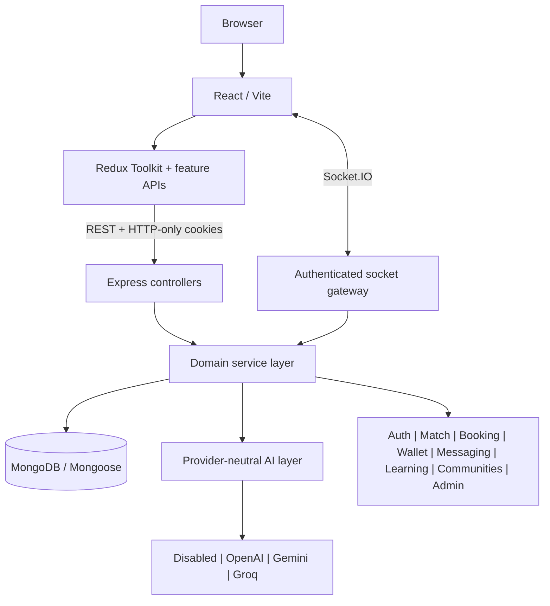
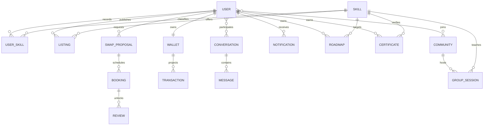

# SkillSwap Architecture

## Current System

SkillSwap is a modularizing MERN monolith:

```text
React 18 + Redux Toolkit + React Router
                 |
       Axios REST + Socket.IO
                 |
Express 4 controllers and domain services
                 |
        Mongoose 8 + MongoDB
```

The frontend is a Vite SPA. The backend owns authentication, authorization, matching, swaps, sessions, chat, reviews, notifications, reports, and analytics. MongoDB is the source of truth. Socket.IO is a delivery channel, never the authority for state changes.

## Architecture Decisions

- Preserve React/Vite, Express, MongoDB, Mongoose, Redux Toolkit, Zod, and Socket.IO.
- Evolve into a domain-oriented modular monolith before considering microservices.
- Keep current `/api/*` routes during migration and expose the same router through `/api/v1/*` for new integrations.
- Keep critical rules in backend services. The client may propose actions but cannot calculate authoritative prices, credits, roles, booking state, or review eligibility.
- Store all booking instants in UTC and retain the user's IANA timezone for display and availability interpretation.
- Use atomic conditional writes and idempotency keys for local credit/booking settlement; use replica-set transactions or an outbox where production workflows span multiple documents.
- Keep match scores deterministic. AI may explain results but does not assign the score.

## Target Domains

Identity, skills, listings, matching, proposals, bookings, messaging, reviews, reputation, wallet, notifications, learning, communities, moderation, and AI.

## Identity and skill data boundary

`User` owns account state and profile presentation. `Skill` owns normalized taxonomy. `UserSkill` is the authoritative relationship for teaching/learning intent and proficiency. Legacy string arrays remain a temporary compatibility projection while older matching and swap flows are migrated. The Phase 3 migration is idempotent and does not remove legacy fields.

Professional profiles cross a serializer boundary: account endpoints return an explicit private projection, while marketplace endpoints return an explicit public projection after visibility checks. Profile aggregates load canonical skills and recent reviews, count completed sessions, and calculate a bounded deterministic SkillScore.

Marketplace discovery queries published listings only and resolves eligible owner IDs before applying listing filters. This keeps profile visibility, rating, language, location, availability, proficiency, and verification constraints server-side. Search returns paginated listings plus bounded skill and mentor result sets; curated sections reuse the same visibility boundary.

The smart matcher is a pure deterministic scoring layer. Eleven factor functions each return 0-100, then fixed weights produce a bounded overall result. Database orchestration supplies canonical user-skill and published listing context; it does not alter scores. Cached results retain factor evidence, and AI may later explain—but never assign—the score.

Canonical swap proposals coexist with the legacy request model during migration. A proposal is an optimistic-concurrency state machine with an explicit `actionRequiredBy` turn, terminal states, bounded expiry, and append-only revision snapshots for counteroffers. Canonical teaching ownership is checked for both sides before creation.

Bookings retain UTC instants plus IANA timezone context. Recurring teacher availability is evaluated in the rule's timezone. Conflict safety uses a materialized 15-minute reservation per participant with a unique `(user, slotStart)` index, so parallel booking attempts cannot both succeed. Rescheduling reacquires reservations and requires confirmation by the other participant.

Booking completion and no-show reporting are terminal, replay-safe settlement transitions available only after the scheduled end. A teacher-reported learner absence settles the earned teaching reward; a learner-reported teacher absence refunds any reserved credits. Both transitions release materialized participant slots and retain the reporter, absent participant, timestamp, and reason for moderation evidence.

The AI boundary is provider-independent. Controllers call one `aiService`; an environment-selected factory owns OpenAI, Gemini, or Groq adapters. Context shaping, intent routing, and prompts are centralized and database-grounded. Provider failures normalize to one error type, transient retries are bounded, and abort-based timeouts prevent hung requests. AI is disabled by default and never owns deterministic product state such as balances, ratings, or match scores.

Career readiness is a deterministic learning-domain boundary. Administrators define versioned career frameworks over canonical skills and minimum proficiency levels. Each analysis stores independent actual-skill and requirement snapshots before deriving missing, weak, and recommended skills. Mentor candidates come only from eligible teaching records and receive an evidence-based suitability score. Provider-generated prose is an optional presentation layer stored separately from those authoritative calculations.

Roadmaps are owner-scoped aggregates with embedded milestones and tasks so progress can be recomputed atomically from one versioned document. Provider output enters only through a strict, bounded milestone/task schema and falls back to a deterministic blueprint; the backend independently resolves the canonical target, optional career/gap provenance, eligible mentors, dates, progress, and lifecycle. Completing a milestone synchronizes its tasks, while task edits roll milestone state upward.

My Learning is a read model, not another source of truth. A single service projects learning-enabled canonical skills, roadmaps, learner bookings, legacy sessions, milestones, certificate records, and goals. Learned hours and summaries are recomputed per request, and a pure UTC-day algorithm derives current/longest streaks from persisted completion timestamps.

Communities separate bounded group metadata from scalable membership, post, and comment collections. A unique community/user membership is the authorization source; admin/moderator arrays are small display projections. Public/private visibility is enforced before feed access, private joining requires an admin invitation, and every write rechecks active membership server-side. Posts model discussions, questions, and validated resource shares without trusting client counters.

Group sessions use a two-part capacity invariant: one unique enrollment document per participant/session and one conditional atomic counter reservation on the session. A pending claim serializes re-enrollment races; any downstream credit failure compensates the seat. Session cancellation refunds active credit enrollments before closing them, while completion settles one aggregate mentor reward. Paid checkout remains fail-closed until the payments phase supplies an authoritative provider.

Challenges split an administrator-authored rule set from per-user progress, daily evidence, XP ledger entries, and badge grants. The service—not the browser—controls sequential day unlocks, UTC activity uniqueness, task XP, completion bonus, streak calculation, and final rewards. Unique database keys make enrollment, XP, credit, badge, achievement, and notification projections replay-safe. Challenge completions also feed the shared My Learning streak read model.

Certificates are immutable credential projections over completed learning evidence, not independently authored claims. Eligibility resolution owns source access, completion status, canonical skill, learner identity, achievement copy, and a source snapshot. One unique source key makes issuance idempotent; a hash covers the immutable public claims. Anonymous verification crosses a dedicated privacy serializer and exposes current validity, while revocation is a separate administrator-only audited transition.

The public skill portfolio is an aggregation boundary rather than a second user record. After enforcing public/member/private visibility, it composes the allowlisted profile serializer with canonical skills, published projects, active certificates, recent verified-session reviews, teaching/learning counts, achievements, and derived mentor evidence. Project authoring remains a separate owner-scoped aggregate so drafts and archived work never leak into shared profiles.

Mentor analytics is a derived read model over domain evidence. Only profile/listing views require a dedicated event collection; event keys salt and hash viewer context, deduplicate one entity view per UTC day, and exclude the subject. Booking, session, proposal, review, credit, and skill metrics are recalculated from authoritative collections for a validated time range. The response carries rate definitions and explicitly separates un-settled paid terms from future payment-ledger revenue.

The activity feed is a secondary projection, not a new source of user-authored truth. Domain services emit idempotent events only after authoritative transitions; reversible milestones hide/reactivate their projection. Feed visibility reuses account/profile state, links cross a strict internal allowlist, and engagement lives in separate unique records so social counters remain derived and replay-safe.

Safety is a cross-domain server boundary. `UserBlock` is queried before every new proposal, request, conversation, message, booking, and realtime call signal, while existing history remains available for evidence. Reports resolve content ownership without trusting a submitted accused-user ID. Booking disputes pause the authoritative booking; only the moderation state machine may restore it or cancel it with an idempotent refund and slot release. Every moderation transition writes a separate audit record and notifies participants through safe internal links.

Administration uses an explicit permission matrix layered over the five role ranks. Routes request a capability such as `content:moderate` or `transactions:read`; the UI merely reflects the server-returned permission set. Role mutations add a second hierarchy invariant so even a permitted actor cannot self-manage, affect an equal/higher role, or assign beyond their rank. Operational lists query authoritative domain collections, credit history remains immutable, and every non-safety mutation writes an immutable `AdminAudit` record. Verification is a two-party workflow over `UserSkill` evidence, not a badge toggle.

The client accessibility boundary is centralized in semantic primitives and the application shell. Inputs, selects, textareas, notices, loading states, tabs, tooltips, and dialogs own their accessible names and relationships. Overlays contain keyboard focus, support Escape, and restore the invoking focus; mobile navigation follows the same rule. Theme tokens include a contrast-safe foreground for semantic accent, success, and danger surfaces, while a global focus-visible treatment and reduced-motion override apply consistently across routes.

The performance boundary treats each SPA route as an independently loaded feature chunk; the landing route and shared shell remain in the entry graph while charting and feature-heavy workspaces load on demand. API responses are compressed, list endpoints are validated and capped, Mongoose read paths prefer projections and `lean()`, and compound indexes match participant/status/time sort shapes. Match scoring persists explainable results and serves privacy-rechecked cache entries for five minutes before recomputation. Uniquely named uploaded assets receive immutable browser caching; above-the-fold hero media remains eager while user-generated list media decodes asynchronously and loads lazily.

Demo data is a deterministic fixture graph, not a database reset. Stable identifiers and domain-level unique keys let the seed upsert its own fictional users, skills, listings, proposals, bookings, reviews, wallets, ledger events, communities, roadmaps, notifications, and projects without deleting unrelated records. Immutable credit entries are insert-only and replay-safe. A post-seed invariant check enforces minimum connected-record counts, and production execution requires an explicit environment acknowledgement.

Observability crosses one redaction boundary before output. API requests receive or generate a constrained correlation ID, return it to callers, and emit a structured completion event without bodies, query values, cookies, authorization headers, or raw credentials. Operational errors add a stable domain code and authenticated subject identifier where available; recursive sanitization removes secret-bearing keys and token-shaped strings. Production configuration is validated before listeners or providers start, including distinct JWT secrets, HTTPS client origins, an independent analytics salt, disabled browser token exposure, and complete credential groups.

## Security Boundary

Browser authentication uses HTTP-only cookies. Bearer responses are disabled by default and may be enabled only for explicit non-browser compatibility with `AUTH_EXPOSE_ACCESS_TOKEN=true`. Socket connections validate the account, conversation membership, and accepted/completed swap relationship before joining rooms or relaying call signals.

Refresh sessions form rotation families: only hashes are stored, rotated members remain revoked evidence until TTL expiry, and reuse revokes every active family member. Uploads use server-generated names, bounded counts/sizes, exact MIME-extension mappings, magic-byte checks, cleanup hooks, and download disposition for documents. Realtime transport has a patched dependency graph, packet ceiling, event throttling, and identifier/payload validation. Paid actions remain fail-closed until a real provider owns checkout and webhook state.

The process lifecycle is observable and bounded: startup validates production configuration before listening, request logs correlate through redacted IDs, SIGINT/SIGTERM stop scheduled work, close the HTTP listener, close MongoDB, and use a ten-second forced-exit ceiling.

See `SKILLSWAP_TECHNICAL_AUDIT.md` for the migration roadmap.

## Runtime Architecture Diagram



## Core Entity Relationships


