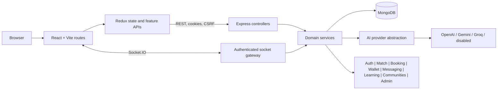

# SkillSwap System Flows

## System Map

## Authentication

1. Login is validated and rate limited. The server verifies the password and account state.
2. The server sets a short-lived HTTP-only access cookie and a rotating HTTP-only refresh cookie. Only refresh-token hashes and family metadata are stored.
3. Protected middleware verifies the access token, reloads active account state, and attaches the user.
4. On refresh, the presented token is atomically revoked and replaced. Reuse revokes the active token family.
5. Authorization combines ownership filters, capability middleware, and role hierarchy. The frontend guard is convenience, not authority.
6. Logout revokes the session and clears cookies. “Log out all” revokes the family/device set.

## Match

1. Load the viewer’s public matching fields and canonical `UserSkill` records.
2. Query active visible user/mentor candidates who teach a wanted skill; exclude self and bilateral blocks.
3. Load candidate skills and published listing terms in batches.
4. Normalize 11 deterministic factors to 0-100.
5. Apply fixed weights totaling 100 and clamp the final score.
6. Rank descending and derive reasons from actual high-scoring factors.
7. Cache factors/reasons for five minutes. Every cache read rechecks account and block privacy.

## Booking

1. Resolve an accepted proposal and derive teacher, student, skill, duration, credits, and payment terms server-side.
2. Validate future time, IANA timezone, teaching availability, block state, and paid-checkout availability.
3. Materialize 15-minute slots for both participants. The unique `(user, slotStart)` index serializes conflicts.
4. Persist the booking and any idempotent SkillCredit reservation. Failure compensates booking and slots.
5. The other participant confirms. Rescheduling reserves net-new slots, compare-and-sets booking version/state, then releases old slots.
6. Completion, cancellation, no-show, and dispute use conditional terminal transitions. Only one competing outcome can win.

## SkillCredits

1. A domain event constructs user, signed integer amount, type, related entity, description, and deterministic idempotency key.
2. `CreditOperation` claims that key. A concurrent duplicate replays or reports in-progress.
3. Debit uses conditional atomic wallet update (`balance >= spend`); credit uses atomic increment.
4. Create immutable `CreditTransaction` with `balanceAfter`, then mark the operation complete.
5. On ordinary downstream failure, compensate the wallet and mark the operation failed.
6. Wallet reads aggregate the ledger and return an explicit integrity result beside the projection.

MongoDB standalone cannot make steps 3-4 crash-atomic. Production should use a replica-set transaction or outbox/reconciliation worker.

## Messaging

1. Socket handshake verifies access token and active account, then joins only `user:<id>`.
2. Conversation creation requires an accepted/completed relationship and no bilateral block.
3. Joining `conv:<id>` reloads participant membership and contact permission.
4. POST send validates participant, relationship, one authorized card, attachments, and UUID `clientMessageId`.
5. Persist message under a unique sender/client ID, update conversation projection, then best-effort notification.
6. Emit to user/conversation rooms. Retry returns the same durable message. Typing and call signaling recheck authorization.

## AI

1. Route or validate an intent.
2. Build a bounded, allowlisted context from authoritative records.
3. Build centralized instructions that mark context as data and reject embedded instructions.
4. Call the configured provider through one timeout/retry/error interface, or use disabled mode.
5. Parse JSON and, where domain state is affected, validate a bounded Zod schema.
6. Return advisory prose/cards. Core domains use deterministic fallback when providers fail.

## Review

1. Resolve a completed booking and verify the requester participated.
2. Derive reviewee from the booking. Never trust a submitted target user.
3. Validate category ratings and text.
4. Insert under unique `(reviewer, session)`.
5. Recalculate reputation from published eligible reviews.
6. Surface review eligibility in booking history and public reputation through projections.

## Why These Choices

- MongoDB fits document-centered profile, roadmap, and booking aggregates while separate collections preserve unbounded messages, membership, and ledgers.
- A service layer keeps HTTP and sockets from duplicating authoritative rules.
- Deterministic matching is testable, explainable, and debuggable; AI is unsuitable for financial or authorization state.
- A ledger supports replay, audit, and reconciliation better than direct balance mutation.
- Provider abstraction makes AI optional and failure-tolerant.
- Socket authorization is rechecked because room membership alone becomes stale after blocks or account changes.
